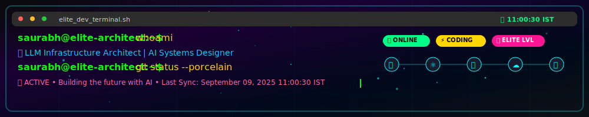

<div align="center">
  
</div>

<br/>

<div align="center">
  
  [](https://git.io/typing-svg)
  
</div>

<div align="center">
  
  
  
  
  
</div>

<br/>

## 🚀  **About The Architect**


```yaml
apiVersion: v1
kind: Developer
metadata:
  name: Saurabh Pareek
  labels:
    role: "LLM Infrastructure Architect"
    expertise: "AI/ML Systems"
    status: "Always Building"
spec:
  languages: [Python, JavaScript, TypeScript]
  frameworks: [FastAPI, React, Next.js, LangChain]
  cloud: [GCP, AWS, Docker, Kubernetes]
  databases: [MongoDB, PostgreSQL, FAISS, Pinecone]
  specialization:
    - Large Language Models
    - Vector Databases
    - MLOps Pipelines
    - Scalable AI Systems