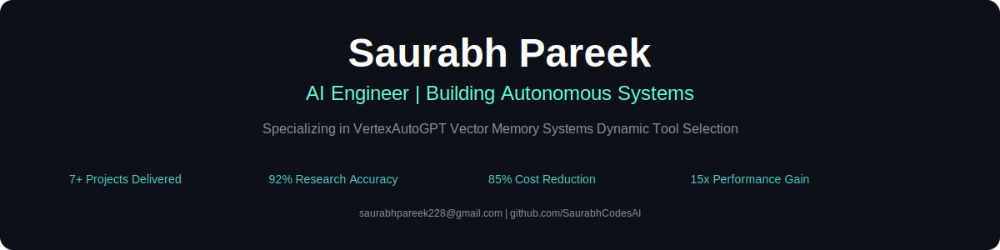

  

## 🜵 About Me
I'm an <strong>LLM Infrastructure Architect</strong> specializing in designing and deploying scalable AI systems. My focus is on creating robust, efficient, and financially viable MLOps pipelines, from advanced vector search implementation to full-stack application deployment. I thrive on translating complex technical challenges into zero-friction, production-ready solutions.

<table>
  <tr>
    <td valign="top" width="60%">
      <h3>⚡ Core Arsenal</h3>
      

        
        
        
        
        
        
        
        
        
        
      

    </td>
    <td valign="top" width="40%">
      

        
        
        
      

    </td>
  </tr>
</table>

---

## 💎 Signature Builds

| Project | Description | Tech Stack |
|---|---|---|
| **[VertexAutoGPT](https://github.com/SaurabhCodesAI/VertexAutoGPT)** | Autonomous research intelligence with persistent vector memory, adaptive tool orchestration, and ruthless cloud cost optimization. | `Python` `Asyncio` `LangChain` `Llama2` `FAISS` `GCP` `FastAPI` `Docker` |
| **[Snap2Slides](https://github.com/SaurabhCodesAI/Snap2Slides)** | Transforms raw visual chaos into polished decks in under 15 seconds via Gemini Vision Pro. | `Next.js` `TypeScript` `Tailwind` `Framer Motion` `Gemini API` `Auth0` `MongoDB` |
| **[core-dev-workflow](https://github.com/SaurabhCodesAI/core-dev-workflow)** | Enterprise-grade automation and orchestrated DevOps rituals for standardized, high-velocity development cycles. | `Python` `CI/CD` `Docker` `Workflow Orchestration` |

---

## 🛠️ Let's Connect

  
I'm always open to discussing LLM infrastructure, scalable AI, or new project collaborations. Feel free to reach out.

  

    
    
    
  

