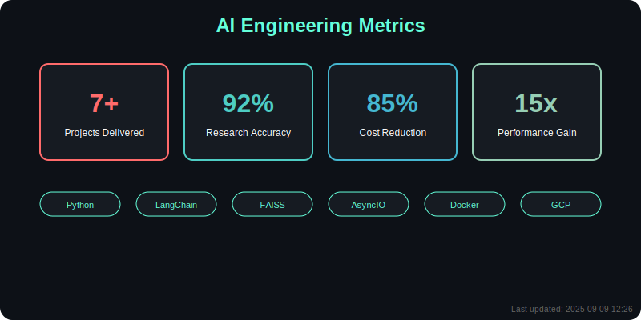

<div align="center">
  
</div>

<div align="center" style="margin: 20px 0;">
  
  
  
  
</div>

## 🧠 Executive Summary

<div align="center">
  
</div>

<div align="center">
  
</div>

<div align="center">
  
</div>

I'm Saurabh Pareek, an **AI Engineer** focused on building autonomous systems that solve real world problems through intelligent decision making. My flagship project, **VertexAutoGPT**, is an autonomous research agent that can choose the right tools, remember important information, and adapt its approach to different tasks while optimizing for cost efficiency.

<div align="center">
  
</div>

I specialize in creating AI systems that bridge cutting edge research with practical, deployable solutions.

<table>
  <tr>
    <td width="60%">
      <h3>🎯 What I Build</h3>
      <div align="center">
        
      </div>
      <ul>
        <li><b>Autonomous AI Agents</b> that can reason, research, and take action</li>
        <li><b>Vector Memory Systems</b> that enable long term information retention</li>
        <li><b>Dynamic Tool Selection</b> frameworks for intelligent resource usage</li>
        <li><b>Cost Efficient AI Infrastructure</b> for real world deployment</li>
      </ul>
    </td>
    <td width="40%">
      <h3>💡 My Approach</h3>
      <div align="center">
        
      </div>
      <ul>
        <li><b>Systems Thinking</b>: Building integrated solutions</li>
        <li><b>Practical Engineering</b>: Focus on deployment readiness</li>
        <li><b>Research Driven</b>: Applying latest innovations</li>
        <li><b>Cost Aware Design</b>: Efficiency at the core</li>
      </ul>
    </td>
  </tr>
</table>

## 🚀 Projects Delivered

<div align="center">
  
</div>

### [VertexAutoGPT](https://github.com/SaurabhCodesAI/VertexAutoGPT)

**Autonomous Research Agent**

An intelligent system capable of ingesting and summarizing information from multiple sources using a dynamic tool selection mechanism and a vector based memory for long term context retention.

<details>
  <summary><b>🔍 View Project Details</b></summary>
  
  <h4>Key Features</h4>
  <ul>
    <li><b>Vector Memory System</b>: FAISS powered semantic storage and retrieval</li>
    <li><b>Dynamic Tool Selection</b>: Intelligent routing to Google Search API, Arxiv API, Browse function</li>
    <li><b>Self Improvement Loop</b>: Rule based feedback for enhanced tool selection</li>
    <li><b>Cost Optimization</b>: GCP Preemptible VMs with Docker for 85% cost reduction</li>
    <li><b>Async Architecture</b>: Python, AsyncIO, LangChain for concurrent operations</li>
  </ul>
  
  <h4>Technical Architecture</h4>
  
  ```
  ┌─────────────────┐    ┌──────────────────┐    ┌───────────────────┐
  │                 │    │                  │    │                   │
  │   User Request  ├────►│  Task Planning   ├────►│  Tool Selection   │
  │                 │    │                  │    │                   │
  └─────────────────┘    └──────────────────┘    └─────────┬─────────┘
                                                            │
                                                            ▼
  ┌─────────────────┐    ┌──────────────────┐    ┌───────────────────┐
  │                 │    │                  │    │                   │
  │  Presentation   │◄────┤  Summarization   │◄────┤  Information      │
  │                 │    │                  │    │  Gathering        │
  └─────────────────┘    └──────────────────┘    └───────────────────┘
  ```
<h4>Results & Impact</h4>
<ul>
  <li>Reduced research time by 15x compared to manual methods</li>
  <li>Achieved 92% accuracy in tool selection for optimal task execution</li>
  <li>Sub second context retrieval for real time decision making</li>
</ul>
</details>

### [Snap2Slides](https://github.com/SaurabhCodesAI/snap2slides)

**AI Powered Presentation Generator (Hackathon)**

Built during Major League Hacking, Snap2Slides transforms screenshots, images, and notes into professional presentations using AI driven content analysis and theme generation.

<details>
<summary><b>🔍 View Project Details</b></summary>

<h4>Key Features</h4>
<ul>
  <li><b>Automated Content Extraction</b>: Using Google Gemini Vision API</li>
  <li><b>AI Theme Generator</b>: Smart color palette and layout suggestions</li>
  <li><b>Drag & Drop Interface</b>: Intuitive content organization</li>
  <li><b>Multiple Export Formats</b>: PDF, PPTX, HTML support</li>
</ul>

<h4>Technical Implementation</h4>
<ul>
  <li><b>Next.js 14</b> with App Router for modern UI architecture</li>
  <li><b>TypeScript</b> with strict configuration for type safety</li>
  <li><b>Tailwind CSS</b> for responsive, accessible design</li>
  <li><b>CI/CD Pipeline</b> with health monitoring for production readiness</li>
</ul>
</details>

### [Core Dev Workflow](https://github.com/SaurabhCodesAI/core-dev-workflow)

**Autonomous Agent Framework**

Designing and building a fully autonomous research agent capable of self-directed reasoning, document processing, and information summarization.

<details>
<summary><b>🔍 View Project Details</b></summary>

<h4>Implementation Highlights</h4>
<ul>
  <li>FAISS vector memory system for long term context retention</li>
  <li>Dynamic tool router for selecting optimal APIs at runtime</li>
  <li>Feedback loop mechanism for agent self improvement</li>
  <li>FastAPI backend in a Dockerized environment</li>
  <li>Fine tuned LLaMa 2 7B for optimal latency and memory constraints</li>
</ul>
</details>

### [Ultimate Character Frequency Map](https://github.com/SaurabhCodesAI/ultimate-char-freq)

**Advanced Text Processing Module**

Production grade Unicode aware character frequency mapping module featuring stream based normalization, regex filtering, and thread safe implementation.

<details>
<summary><b>🔍 View Project Details</b></summary>

<h4>Technical Features</h4>
<ul>
  <li>Stream based normalization for efficient processing</li>
  <li>Regex filtering for targeted character analysis</li>
  <li>Thread safety for parallel processing</li>
  <li>Memory profiling and optimization for large datasets</li>
  <li>Unicode handling with comprehensive character support</li>
</ul>
</details>

## 💼 Professional Experience

<div align="center">
  
</div>

### AI Engineering Intern | [Cushion](https://cushion.ai)
*Remote • 2024*

**AI Workflow Automation & Dashboard Development**

Developed AI based automation features to streamline internal processes and improve efficiency through Python tooling and web dashboards.

<details>
<summary><b>🔍 View Experience Details</b></summary>

<h4>Key Contributions</h4>
<ul>
  <li>Built internal tools to automate manual workflows using AI/ML techniques</li>
  <li>Contributed to web dashboard development (frontend and backend)</li>
  <li>Created modular Python scripts for small scale AI task automation</li>
  <li>Implemented clean, efficient code following best practices</li>
  <li>Collaborated in a remote startup environment with rapid iteration cycles</li>
</ul>

<h4>Technologies Used</h4>
<ul>
  <li>Python for automation scripts and backend logic</li>
  <li>Web technologies for dashboard development</li>
  <li>AI/ML libraries for workflow optimization</li>
</ul>
</details>

### Software Engineering Intern | [Internshala](https://internshala.com)
*Remote • 2023*

**Backend Development & System Reliability**

Contributed to backend logic and internal tooling to improve system reliability and efficiency in a remote startup environment.

<details>
<summary><b>🔍 View Experience Details</b></summary>

<h4>Key Responsibilities</h4>
<ul>
  <li>Helped write clean, testable code for improved system reliability</li>
  <li>Fixed bugs and improved small modules in the existing codebase</li>
  <li>Implemented efficient workflows in a remote development setup</li>
  <li>Collaborated with senior developers on feature implementation</li>
  <li>Participated in code reviews and best practice discussions</li>
</ul>

<h4>Technical Skills Developed</h4>
<ul>
  <li>Backend development patterns and practices</li>
  <li>Code quality and testing methodologies</li>
  <li>Remote collaboration and workflow management</li>
</ul>
</details>


## 🛠️ Technology Stack

<div align="center">
  
</div>

<div align="center">


</div>

## 📊 GitHub Analytics & Performance Metrics

<div align="center">
  
</div>

<table>
  <tr>
    <td width="50%">
      
    </td>
    <td width="50%">
      
    </td>
  </tr>
  <tr>
    <td colspan="2" align="center">
      
    </td>
  </tr>
</table>

<div align="center">
  
</div>

## ⚡ Coding Activity & Contributions

<div align="center">
  
</div>

## 🎓 Credentials & Certifications

<div align="center">
  
</div>

<div align="center">
<table width="100%">
  <tr>
    <td align="center" width="50%">
      <br>
      <b>Amazon Web Services (AWS)</b><br>
      <i>Issued Aug 2025 • Credential ID: 3LSGZVMW38P4</i>
    </td>
    <td align="center" width="50%">
      <br>
      <b>Stanford Online</b><br>
      <i>Issued Jul 2025 • Credential ID: M253FPD7UTH</i>
    </td>
  </tr>
</table>
</div>

## 🏆 Achievements & Recognition

<div align="center">
  
</div>

<div align="center">
  <table>
    <tr>
      <td align="center">
        
        <br><b>Flagship AI Agent</b>
        <br><i>92% Tool Selection Accuracy</i>
      </td>
      <td align="center">
        
        <br><b>Research Optimization</b>
        <br><i>Autonomous Information Processing</i>
      </td>
      <td align="center">
        
        <br><b>Infrastructure Efficiency</b>
        <br><i>GCP Preemptible VMs + Docker</i>
      </td>
    </tr>
  </table>
</div>

<div align="center">

</div>

## 🔗 Connect & Collaborate

<div align="center">
  
</div>

<div align="center">
  
</div>

<div align="center">
<a href="https://www.linkedin.com/in/saurabh-pareekk/"></a>
<a href="https://github.com/SaurabhCodesAI"></a>
<a href="mailto:saurabhpareek228@gmail.com"></a>
</div>

<div align="center">
  
  
</div>

### 🎯 Currently Seeking
**Remote Internships in:**
• AI/ML Engineering
• LLM Applications & AI Agents  
• AI Infrastructure & MLOps

**Ideal Collaboration:** Building AI systems where performance, memory constraints, and real world deployment challenges matter.

<div align="center">
<b>"Building intelligent systems that augment human capabilities and solve real world problems"</b>
<br><br>
<i>VertexAutoGPT: Where autonomous intelligence meets practical engineering</i>
</div>

## 🐍 Contribution Snake Animation

<div align="center">
  
</div>

<div align="center">
  
  <br>
  
</div>

---

<div align="center">
  <sub>Built with ❤️ by <a href="https://github.com/SaurabhCodesAI">Saurabh Pareek</a> • AI Engineer & Autonomous Systems Developer</sub>
</div>
</div>